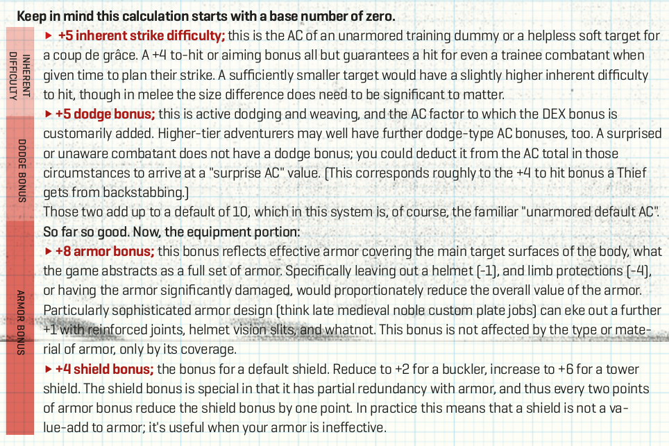

# Alternative Rüstungsregeln nach Knock!#4

## Einleitung

In dem Artikel "Novel AC math or armor penetration made easy" von Eero Tuovinen in [Knock! Ausgabe 4](https://www.themerrymushmen.com/product/knock-4-tmm/) wird ein Modell für die Berechnung von Rüstungsklassen vorgestellt, das ich ganz interessant finde.

Nicht nur, dass es einen Ausweg aus dem "wenn ich eine schwerere Rüstung habe, bin ich schwieriger zu verletzen, egal mit was" Problem liefert, es scheint auch noch verhältnismäßig einfach und am Tisch verwendbar zu sein. So man also Lust auf "etwas" mehr Realismus bei seinen D&D Rüstungen haben will,dann könnte das System hier ganz interessant sein.

## Die Grundlagen in Stichpunkten

Die Rüstungsklasse (AC, Armor Class) in D&D und verwandten Systemen ist ein abstrakter Wert für die Schnelligkeit und Widerstandsfähigkeit eines Charakters, sprich, wie schwierig er oder sie zu verwunden ist. Schwere Rüstungen machen einen Charakter generell langsamer und Schilde geben je nach System einen Bonus oder haben eine prozentuale Chance, einen Treffer zu negieren.  

- Die Art der Rüstung sagt nichts darüber aus, wogegen sie schützt. Jede Art von Rüstung schützt zum Beispiel genauso gut gegen einen Dolch wie gegen eine Hellebarde.
- Aktuell kann man sich eine bessere "Rüstungszahl" einfach mit Geld kaufen.
- Ein Schwert sollte gegen eine Schwere Rüstung nicht genauso effektiv sein wie ein Bec-de-Corbin
- Schilde sollten besser sein
- Leichte Rüstungen sollten effektiv gegen leichte Waffen sein.

## Das neue System

Das neue System ändert ein paar der oben genannten Grundlagen:

- Der *Wert* der Rüstungsklasse wird nicht mehr durch ihren *Typ* bestimmt. Die Rüstungsklasse sagt jetzt eher aus, ob die Rüstung gegen einen bestimmten Angriff *effektiv* ist.
- Schilde sind jetzt besonders nützlich, wenn die Rüstung nicht effektiv ist.

Aus dem oberen Bild lässt sich gut erkennen, wie das System "Rüstung aufschlüsselt.

1. Gestartet wird mit einem Wert von 0
2. Auf diesen Wert wird eine inhärente Trefferschwierigkeit von +5 addiert (inherent strike difficulty). Dies ist die Rüstungsklasse eines ungepanzerten, unbeweglichen Ziels, wie zum Beispiel einer Trainingspuppe.
3. Aktives ausweichen addiert weitere +5 auf die Rüstungsklasse. Damit sind wir bei den normalen AC10 eines ungepanzerten Menschen. Hier können noch zusätzliche Boni wie der Dex-Bonus draufkommen. Wenn der Charakter überrascht ist, fällt der Dodge-Bonus weg.
4. +8 Armour Bonus: Dieser Wert spiegelt eine vollständige Rüstung, inklusive Helm, Arm- und Beinschutz wider. Es ist egal, ob es sich hierbei um Leder oder Platte handelt, der Wert ist erstmal +8. Wenn man den Helm o.Ä weglässt, geht dieser Wert nach unten.
5. +4 Schild-Bonus: Dieser Wert ist ein normaler Schild, ein Buckler wäre +2, ein Turmschild +6. Der Schild überlappt sich mit der Rüstung und verliert einen Punkt für je zwei Punkte Rüstung. Damit ist der Schild eher nützlich, wenn die Rüstung teilweise oder vollständig ineffektiv ist.

Hier lässt sich auch erkennen, dass die *Art* der Rüstung nicht die Rüstungsklasse widerspiegelt. Stattdessen gibt sie an, wie *effektiv* die Rüstung gegen eine spezifische Art von Angriff ist.

Jede Rüstung, die voll effektiv gegen etwas ist *und* vollständig schützt (Torso, Arme, Beine, Kopf) hat damit AC 18.

Damit ergeben sich unter Anderem die folgenden Zustände einer Rüstung:

|Zustand|Armor Class|Bemerkung|
|---|---|---|
|Vollständig effektiv, volle Rüstung| AC 10[5 + 5 Dodge]+8[Volle Rüstung] = 18| Ich hab eine volle Rüstung und der Gegner hat keine für mich panzerbrechende Waffe...nice|
|Vollständig effektiv, halbe Rüstung| AC 10[5 + 5 Dodge]+4[Halbe Rüstung] = 14|Könnte zum Beispiel eine Brustplatte mit Armschienen sein|
|Teilweiser Durchschlag, volle Rüstung|AC 10[5 + 5 Dodge]+4[teilweise schützende Rüstung] = 14|Der Angreifer verwendet eine Waffe, gegen die die Rüstung nicht gut schützt|
|Vollständiger Durchschlag|C 10[5 + 5 Dodge]+0[Rüstung ineffektiv] = 10|Der Gegner verwendet eine Waffe, die durch die Rüstung durchgeht wie durch Butter. Zum Beispiel ein schwere Keule gegen ein Kettenhemd|
