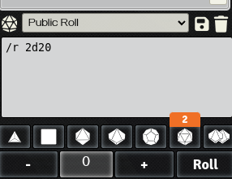
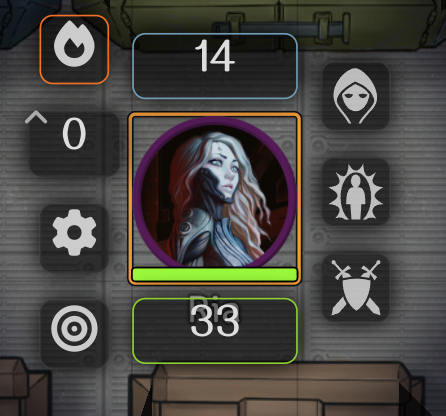
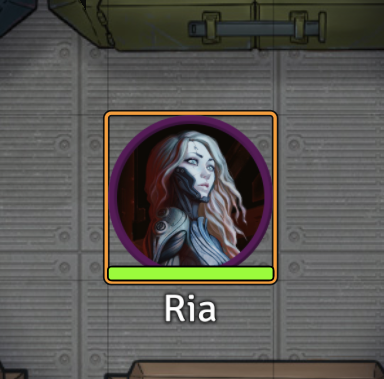
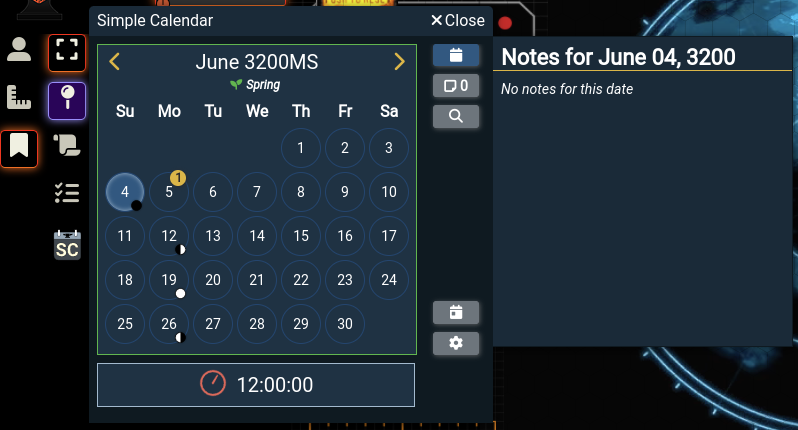
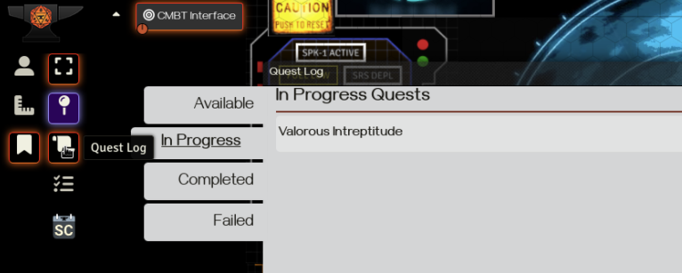
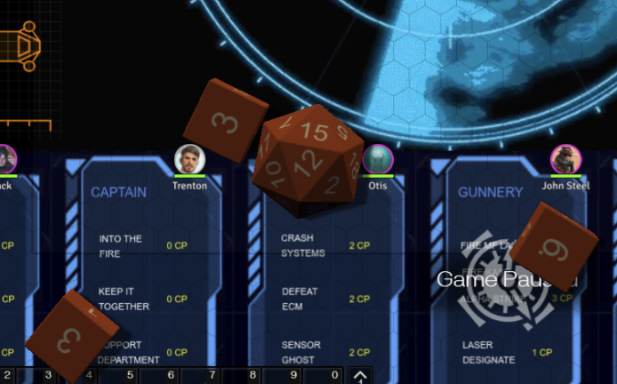
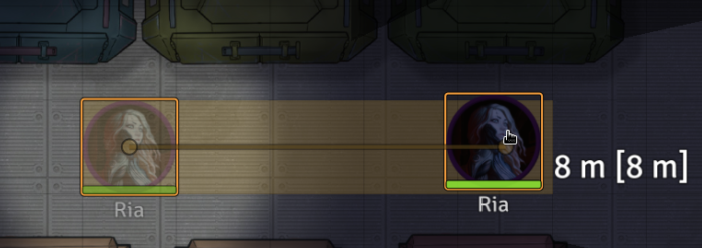
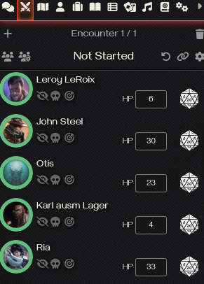
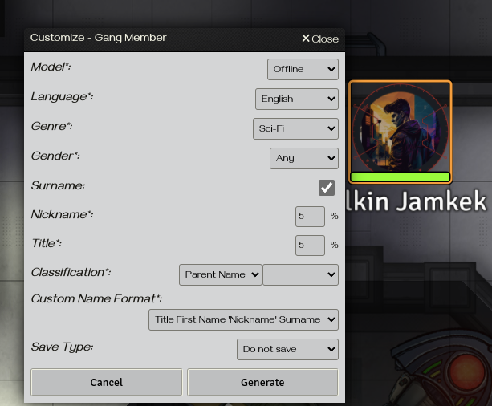

# Foundry VTT - Settings und Modules

- [Foundry VTT - Settings und Modules](#foundry-vtt---settings-und-modules)
  - [Settings](#settings)
  - [Empfehlenswerte Module](#empfehlenswerte-module)
    - [Dice Tray](#dice-tray)
    - [Torch](#torch)
    - [Tokenizer](#tokenizer)
    - [Simple Calendar](#simple-calendar)
    - [Forien's Quest Log](#foriens-quest-log)
    - [Dice So Nice](#dice-so-nice)
    - [Drag Ruler](#drag-ruler)
    - [Hey, Wait!](#hey-wait)
    - [Not Your Turn](#not-your-turn)
    - [Combat Enhancements](#combat-enhancements)
    - [Chat Portrait](#chat-portrait)
    - [Random Procedural Names](#random-procedural-names)

## Settings
1. **Core::Left-Click to release objects**: Aktiviert das Entmarkieren von Objekten, wenn man auf einen leere teil der Karte klickt. Ist diese Option nicht aktiv, muss man Escape oder Shift-Linksklick drücken.
2. **Core::Token drag vision**: Rendert die Karte schon beim ziehen eines Tokens. Ist per default deaktiviert, da sich so schnell die Karte aufdecken lässt, ohne sich tatsächlich zu bewegen.

## Empfehlenswerte Module

### Dice Tray
[Dice Tray](https://foundryvtt.com/packages/dice-calculator) liefert einige Buttons mit gängigen Würfeln unterhalb des Chatfensters. Ein Linksklick auf einen Würfel erhöht die Anzahl der zu werfenden Würfel um 1, ein Rechtsklick senkt sie um 1. 

### Torch
[Torch](https://foundryvtt.com/packages/torch) liefert eine einfache Möglichkeit, bei einem Token eine Lichtquelle einzuschalten und (falls konfiguriert) automatisch Fackeln oder andere Lichtquellen aus dem Inventar des Charakters zu entfernen. 

### Tokenizer
[Tokenizer](https://foundryvtt.com/packages/vtta-tokenizer) Gibt die Option, aus einem Charakterprtrait direkt ein Tokenbild zu generieren und zuzuweisen.

### Simple Calendar
[Simple Calendar](https://foundryvtt.com/packages/foundryvtt-simple-calendar) liefert genau das, einen konfigurierbaren Kalender, in dem zum Bespiel Notizen, Feiertage, oder Ähnliches Hinterlegt werden können. 

### Forien's Quest Log
[Forien's Quest Log](https://foundryvtt.com/packages/forien-quest-log) ist ein ziemlich elaboriertes Questlog, in dem sich Quests, Subquests, Belohnungen und vieles mehr tracken lassen. 

### Dice So Nice
[Dice So Nice](https://foundryvtt.com/packages/dice-so-nice) bringt 3D Würfel ins Spiel, die bei jedem Würfelwurf uber den "Tisch" rollen und dann langsam verschwinden. Die Würfel können von jedem Spieler über die Settings personalisiert werden.

### Drag Ruler
[Drag Ruler](https://foundryvtt.com/packages/drag-ruler) Zeigt ein Massband in der Skalierung der aktuellen Karte, wenn man ein Token bewegt. Die Farbe verändert sich, wenn man die im Charakterblatt eingestellte Bewegungsreichweite überschreitet. 

### Hey, Wait!
[Hey, Wait!](https://foundryvtt.com/packages/hey-wait) ist ein GM-Tool, das das Spiel anhält und auf das aktuelle Token fokussiert, wenn ein vorher eingestellter Bereich überschritten wird, zum Beispiel bei einer Falle. Noice...

### Not Your Turn
[Not Your Turn](https://foundryvtt.com/packages/NotYourTurn) verbietet Bewegung im Kampf, wenn man nicht dran ist.

### Combat Enhancements
[Combat Enhancements](https://foundryvtt.com/packages/combat-enhancements) erweitert den Initiativetracker um einen Gesundheitsbalken für Tokens, die Option, Tokens per Drag&Drop zu verschieben und die Möglichkeit, die HP von Teilnehmern direkt zu verändern. 

### Chat Portrait
[Chat Portrait](https://foundryvtt.com/packages/chat-portrait) Zeigt das Token oder das Charakterportrait eines handelnden Charakters im Chat an.

### Random Procedural Names
[Random Procedural Names](https://foundryvtt.com/packages/rp-names) generiert automatisch Namen für Npcs, wenn man das Token auf die Karte zieht. Verfügt über eine Menge an einstellbaren Optionen, wie und für welche Klasse (Typ, Spezies) von Npc die Namen generiert werden. 
 
**Achtung**: Diese Mod hat einige Premiumfeatures und funktioniert nicht korrekt, wenn man den Mist nicht über Patreon kauft!