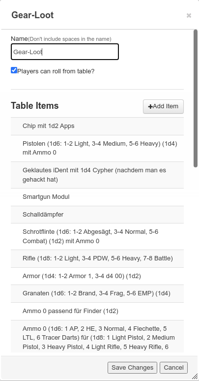
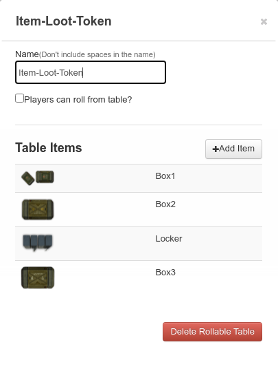
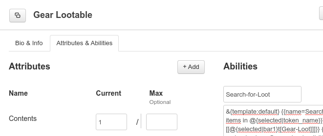
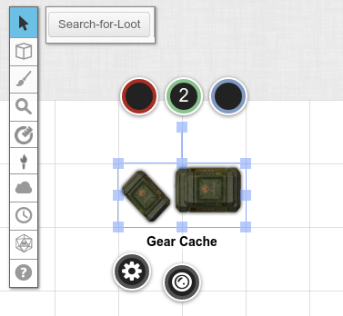
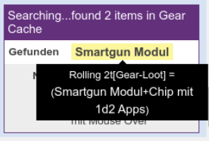
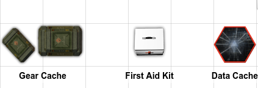

# Creating a random loot generator with placeable containers in Roll20

## Create your loot

First, create a [rollable table](https://help.roll20.net/hc/en-us/articles/360039178754#Collections-RollableTables) and fill it with anything you want your players to find and set it up so that your players can roll from it.



## Create yout container Token

Second, create a rollable table that contains all the containers you want to place. This table can place a [token with multiple "sides"](https://help.roll20.net/hc/en-us/articles/360039178754#Collections-CreatingaRollableTableToken)



## Create a character with a single purpose

Create a new character whose only ability is rolling for a certain amount of loot.

Make the charater controllable by all players and set the loot ability as a token action.



```javascript

// roll n-times on loot table, where n is the number specified in bar1 of the currently selected token

&{template:default} {{name=Searching...found @{selected|bar1} items in @{selected|token_name}}} {{found=[[@{selected|bar1}t[Gear-Loot]]]}} {{notiz=If container contains more than one item, check the output via mouse over}}

```

## Bring it all together

Create a token from your container table and [link](https://help.roll20.net/hc/en-us/articles/360039715593-Linking-Tokens-to-Journals) it to the new character. Assign the `Contents` attribute to `Bar 1` to get a value and then set it back to 'None'. That way, the token starts with a value but not all tokens of this character manipulate the same attribute. Save the token settings, go into the character and tell it to use the selected token.

Now you have the ability to place a container with different visuals where players can roll for random loot when they search it.



The results look something like this



## It works for all kinds of things



## The stupid mouse over thing

Rolling multiple times on a table in a single roll does not expand the result into multiple lines of text. Instead, it shows only the first result and the rest is put into the result alt-text. There is an API command to expand table results recursively, but you'd need a Pro subscription to use it and I ain't payin' a 100 Bucks a year for that.
