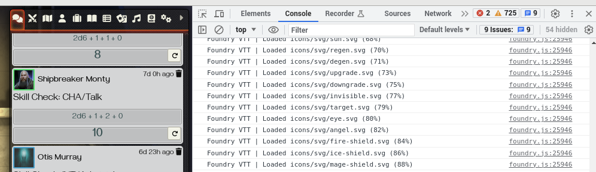
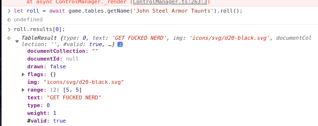
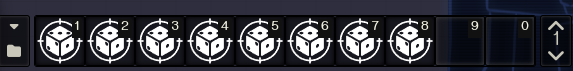
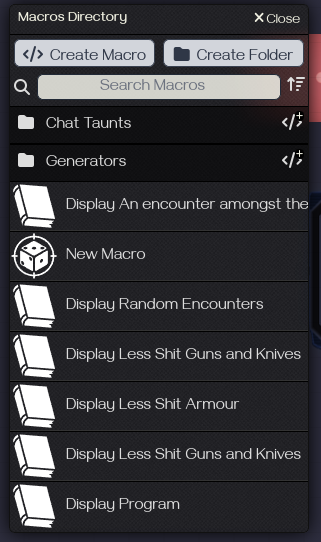
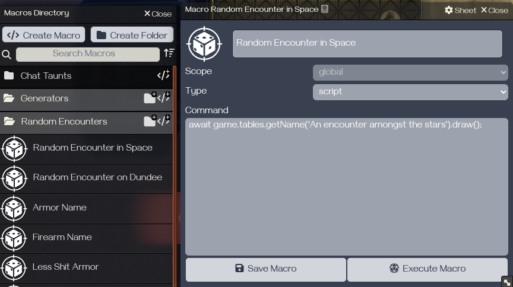
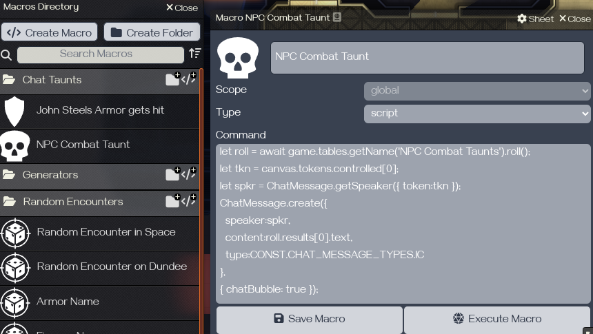
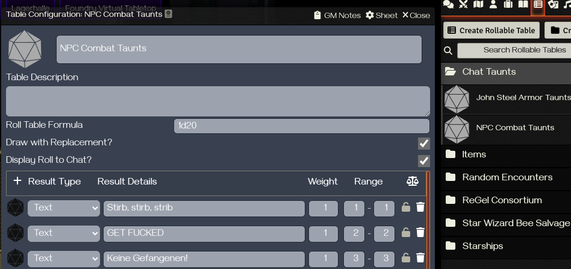
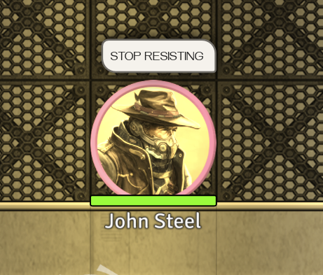

# Macro Basics für Foundry VTT

- [Macro Basics für Foundry VTT](#macro-basics-für-foundry-vtt)
  - [Einstieg](#einstieg)
    - [JavaScript Grundlagen](#javascript-grundlagen)
      - [Klammern, Kommentare und Escapesequenzen](#klammern-kommentare-und-escapesequenzen)
        - [Klammern](#klammern)
        - [Kommentare](#kommentare)
        - [Escapesequenzen](#escapesequenzen)
      - [Datentypen und Variablen](#datentypen-und-variablen)
        - [Deklaration und Verwendung von Variablen](#deklaration-und-verwendung-von-variablen)
        - [Was tun mit Variablen?](#was-tun-mit-variablen)
        - [Arrays](#arrays)
      - [Operatoren](#operatoren)
      - [The fuck ist `this`?](#the-fuck-ist-this)
      - [Funktionen](#funktionen)
        - [Verschiedene Arten, eine Funktion zu deklarieren?](#verschiedene-arten-eine-funktion-zu-deklarieren)
      - [Kontrollstrukturen](#kontrollstrukturen)
        - [`if-else` und `?:`](#if-else-und-)
        - [Schleifen](#schleifen)
    - [Was ist ein Script-Macro?](#was-ist-ein-script-macro)
  - [Debugging in Foundry](#debugging-in-foundry)
  - [Macros in Foundry anlegen](#macros-in-foundry-anlegen)
  - [Einfache Macros](#einfache-macros)
    - [Auf einer Zufallstabelle würfeln, ohne die Tabelle öffnen zu müssen](#auf-einer-zufallstabelle-würfeln-ohne-die-tabelle-öffnen-zu-müssen)
    - [Ein bestimmtes Token auf der Oberfläche (Canvas) finden und auswählen](#ein-bestimmtes-token-auf-der-oberfläche-canvas-finden-und-auswählen)
    - [Einen Schlachtruf aus einer Zufallstabelle würfeln und als Sprechblase ausgeben](#einen-schlachtruf-aus-einer-zufallstabelle-würfeln-und-als-sprechblase-ausgeben)

## Einstieg

Foundry verwendet im Unterbau einen JavaScript Interpreter, daher können ganz normale JavaScriptbefehle innerhalb von Foundry eingegeben werden. Foundry selbst hat eigene Schnittstellen, über die sich so ziemlich alles innerhalb des Programms steuern lässt.

Ich habe von JavaScript auch keine Ahnung, daher sind die meisten Sachen entweder aus dem Netz zusammengeklaut, oder durch ausprobieren gefunden worden.

<div style="page-break-after: always;"></div>

### JavaScript Grundlagen

JavaScript ist eine interpretierte Programmiersprache (**NICHT WEGLAUFEN, ES KANN ANGST RIECHEN UND REAGIERT AUF BEWEGUNG!**), das heisst, sie muss nicht übersetzt werden, sondern der Code wird direkt zur Laufzeit ausgewertet. Der Vorteil ist, man braucht keinen Compiler, der Nachteil, man braucht eine Umgebung, die JavaScript interpretieren kann (wie die meisten Browser und auch Foundry). Generell st ein Skript ein kurzes Stück Code, das (wie so viele Dinge) einem einfachen Konzept folgt:

1. Nimm oder finde etwas
2. Tu etwas mit dem Gefundenen

Ein (meiner Meinung nach) sehr gutes [JavaScript-Tutorial kann hier gefunden werden](https://www.w3schools.com/js/) (Englisch). Ich liste trotzdem die allergrundlegensten Dinge einmal auf.

#### Klammern, Kommentare und Escapesequenzen

##### Klammern

Ok, Klammern in der Programmierung sind immer seltsam. Es gibt im Grunde drei Arten von Klammern:

1. Runde Klammern `()`: Diese Klammern werden bei Deklaration und Aufruf von [Funktionen](#funktionen) verwendet. Außerdem kann man sie benutzen, um mathemathische Ausdrücke zu gruppieren (2+3*4 ist nicht das Gleiche wie (2+3)*4).
2. Eckige Klammern `[]`: Eckige Klammern werden bei der Deklaration von [Arrays](#arrays) und dem Verwenden einzelner Werte *in* Arrays verwendet.
3. Geschweifte Klammern `{}`: Diese Klammern begrenzen einen sogenannten Block, wie zum Beispiel ein Objekt, eine Schleife oder eine Verzweigung. Sie leifern damit auch Kontext für [`this`](#the-fuck-ist-this).

##### Kommentare

Kommentare im Code werden nicht ausgewertet und treten in zwei Arten auf; einzeilig (`//`) und mehrzeilig (`/**/`). Meist reichen einzeilige Kommentare aus.

```js
// Das hier ist ein einzeiliger Kommentar

/* Das hier ist ein mehrzeiliger Kommentar.
Alles, was zwischen diesen zeichen steht
wird nicht ausgewertet. */
```

<div style="page-break-after: always;"></div>

##### Escapesequenzen

Es gibt einige Zeichen (wie Anführungszeichen, \\ oder Klammern), die von der Programmiersprache reserviert sind (besonders bei Strings). Daher kann ich sie in Zeichenketten nicht ohne Weiteres verwenden, da das System sie auf eine bestimmte Art auswerten würde. Wenn ich sie doch verwenden will, muss ich dem System sagen, dass es sie nicht auswerten soll, ich muss sie "escapen". Das wird normalerweise durch einen vorgestellten `\` gelöst.

```js
// Das hier funktioniert nicht, weil JavaScript nicht mehr feststellen kann, wo die Zeichenkette aufhört
let kaputterText = "Sein Name ist "John Steel"."; 

// Also muss man die Anführungszeichen escapen
let funktionierenderText = "Sein Name ist \"John Steel\"."; 
```

<div style="page-break-after: always;"></div>

#### Datentypen und Variablen

JavaScript kennt prinzipiell 8 Datentypen, die für uns relevanten sind: Zahlen (Number), Zeichenketten (String) und Objekte (Object). Weiterhin gibt es noch Arrays (Auflistungen), die ein spezieller Fall von Object sind und einige sehr interessante Optionen bieten.

##### Deklaration und Verwendung von Variablen

Eine Variable ist erst einmal ein Platzhalter für einen beliebigen Wert, mit dem ich später etwas tun möchte. Ich kann den Wert fest zuweisen, oder ihn mir (z.B. in Foundry) aus den Daten der Umgebung heraussuchen.

JavaScript erkennt normalerweise bei der "Deklaration" (Erschaffung) von Variablen, welchen Datentyp sie haben, man muss sich nicht wirklich darum kümmern.

JavaScript kennt grundsätzlich drei Arten, eine Variable zu "deklarieren" (erschaffen):

1. `var`: Erschafft eine "globale" Variable (Kann überall im Skript verwendet werden). Leicht veraltet und für Foundry meist unnötig.
2. `let`: Erschafft eine "lokale" Variable (Kann nur im aktuellen Block verwedent werden). Standard.
3. `const`: Erschafft eine Konstante und ist der Standardweg für die Erschaffung von Objekten. Konstanten können nach der Deklaration nicht mehr verändert werden, wenn es Objekte sind die inneliegenden *Werte* aber schon (das ist etwas seltsam).

Eine Variable wird immer auf die gleiche Art deklariert: `Schlüsselwort Name = Wert`. Das Schlüsselwort gibt an, dass ich eine Variable deklarieren möchte, der Name ist, nun, der Name, über den ich auf die Variable zugreife, und der Wert ist der Inhalt der Variablen. 
Generell kann man Variablen nennen, wie man will, solange der Name nicht mit einer Zahl beginnt! Generell ist von Umlauten und Sonderzeichen abzuraten, da diese nicht in allen Sprachen vorhanden sind.

Ein paar Beispiele:

```js
let eineZahl = 5; // Erschafft eine Variable, die den Wert 5 enthält
let nochEineZahl = 25;
let einString = "Moped" // Erschafft eine Zeichenkette
let nochEinString = "5";
let stringMitBackTics = `Das ist auch ein String`; // Ein sogenanntes Template-Literal, damit kann man wilde Sachen machen
const PI = 3.1415926539; // Konstante, kann nicht mehr verändert oder neu zugewiesen werden.

PI = 5; // Das hier wirft einen Fehler, Konstanten darf man nicht verändern

const karl = {
  name: "Karl Eduard zu Steinbrück IV.",
  title: "Gentleman Adventurer, Esq.",
  level: 10
}; // Ein Objekt, die Werte im Innern können verändert werden

// Objekte lassen sich verändern, auch wenn die Variable als Konstante deklariert ist
karl.level = 11; // Wert ändern
karl.system = "Pathfinder 1E"; // Wert hinzufügen
```

##### Was tun mit Variablen?

Wie gesagt, Variablen sind Platzhalter, mit denen ich etwas tun kann; Zahlen kann man addieren, Strings verändern, etc. Wirft man einen Blick auf das vorherige Beispiel, fallen einige einfache Operationen auf, die man tun könnte:

```js
let eineZahl = 5; 
let nochEineZahl = 25;
const PI = 3.1415926539; 

const karl = {
  name: "Karl Eduard zu Steinbrück IV.",
  title: "Gentleman Adventurer, Esq.",
  level: 10
};

// Addition
let addition = eineZahl + nochEineZahl; // addition = 30

// Kreisfläche
let radius = 20;
let area = PI * Math.pow(radius, 2); // Pi mal Radius zum Quadrat

// String zusammführen
// ergibt "Karl Eduard zu Steinbrück IV., Gentleman Adventurer, Esq., Level: 10"
let karlHalt = karl.name + ", " + karl.title + ", Level: " + karl.level; 

// ergibt "Karl Eduard zu Steinbrück IV., GENTLEMAN ADVENTURER, ESQ., Level: 10" 
let karlMitInterpoliertemString = `${karl.name}, ${karl.title.toUpperCase()}, Level: ${karl.level}`;
```

##### Arrays

Arrays sind effektiv Listen von Werten, die sich über ihren *Index* ansprechen lassen. Der Index gibt die Position des Wertes im Array an, beginnend mit 0.

```js
const wochenTage = ["Montag", "Dienstag", "Mittwoch", "Donnerstag", "Freitag", "Samstag", "Sonntag"];
const wildeZahlen = [0, 500, 18, 27, 666];

let einWochenTag = wochenTage[0]; // Wert = "Montag"
let einWertAusDemArray = wildeZahlen[1]; // Wert = 500
```

Es gilt generell als gute Form, Variablen und Funktionen am Anfang des Codes (Skripts) zu deklarieren, aber prinzipiell ist es egal, wo sie angelegt werden.

<div style="page-break-after: always;"></div>

#### Operatoren

Operatoren sind Elemente, mit denen man Operationen durchführen kann (duh!), z.B. zwei Zahlen addieren.

**ACHTUNG**: Vergleichsoperatoren (`==, ===, !=, etc`) liefern bei Objekten `false` zurück, wenn es sich nicht um *das selbe* Objekt handelt. Selbst wenn die enthaltenen Werte gleich sind, die Referenzen sind es nicht.

|Operator|Was tut der?|
|:----------:|:----------|
|`+`|Addiert zwei Zahlen oder fügt zwei Strings zusammen (c = a + b)|
|`-`|Subtrahiert zwei Zahlen (c = a - b)|
|`*`|Multipliziert zwei Zahlen (c = a * b)|
|`/`|Dividiert zwei Zahlen (c = a / b)|
|`%`|Modulo. Gibt den **Rest** einer Division zurück (mod = a % b, 5 % 2 wäre 1, weil 4 / 2 = 2 Rest 1)|
|`&`|Bitweises UND. Führt einen bitweisen Vergleich durch|
|`\|`|Bitweises ODER. Führt einen bitweisen Vergleich durch|
|`&&`|Logisches UND. Führt einen logischen Vergleich durch|
|`\|\|`|Logisches UND. Führt einen logischen Vergleich durch|
|`=`|Zuweisung|
|`+=`|Addieren und zuweisen (x += 5 ist das gleiche wie x = x + 5)|
|`-=`|Subtrahieren und zuweisen (x -= 5 ist das gleiche wie x = x - 5)|
|`!=`|Vergleich auf Ungleichheit von zwei Werten (a != b ist `true` wenn beide *unterschiedliche* Werte haben)|
|`==`|Vergleich auf Gleichheit (a == b ist `true` wenn beide *gleiche* Werte haben)|
|`===`|Vergleich auf Gleichheit (a === b ist `true` wenn beide *gleiche* Werte *und* Typen haben)|
|`<=`|Kleiner gleich|
|`>=`|Größer gleich|
|`<`|Kleiner als|
|`>`|Größer als|
|`?:`|Ternärer Operator. Effektiv das gleiche wie `if-else`|

<div style="page-break-after: always;"></div>

#### The fuck ist `this`?

Das `this` Schlüsselwort ist interessant, da es in vielen Programmiersprachen auftaucht und sich immer auf das umgebende *Objekt* bezieht und man damit Variablen im Kontext dieses Objektes ansprechen kann (hier: innerhalb eines Blocks). Es ist meist nicht notwendig, wird aber gerne verwendet, um explizit darauf aufmerksam zu machen, welche Variable man anspricht, besonders, wenn man Variablen hat, die den gleichen Namen in verschiedenen Kontexten haben (Würde ich bei kleinen Skripten nicht empfehlen).

```js
let kontext = "Globaler Kontext";

let someObject = {
  kontext: "Lokaler Kontext", 
  getLocalContext: function {return this.kontext;},
  getGlobalContext: function {return kontext;}};

let currentContext = someObject.getGlobalContext(); // Wert = "Globaler Kontext"
currentContext = someObject.getLocalContext(); // Wert = "Lokaler Kontext"
```

<div style="page-break-after: always;"></div>

#### Funktionen

Funktionen sind Codes, die man immer wieder verwenden kann, zum Beispiel eine Funktion zum addieren.
Funktionen werden über das Schlüsselwort `function` deklariert.
Funktionen können Werte übergeben bekommen (Parameter) und können Werte zurückgeben. Sie können Parameter haben, müssen sie aber nicht. Die Namen der Parameter haben die gleichen Beschränkungen wie Variablen.
Funktionen werden deklariert über `function NameDerFunktion(parameter1, parameter2, ...){Code der Funktion}`.

Alle Datentypen bringen eigene Funktionen mit, z.B. lässt sich die Funktion `toString()` auf jede Variable anwenden. Der volle Umfang und die Verwendung sind im oben verlinkten Tutorial beschrieben.

```js
let eineZahl = 5; 
let nochEineZahl = 25;

const karl = {
  name: "Karl Eduard zu Steinbrück IV.",
  title: "Gentleman Adventurer, Esq.",
  level: 10,
  fullName: function {return `${this.name}, ${this.title.toUpperCase()}, Level: ${this.level}`;}
};

function addiere(zahl1, zahl1) // Deklariere eine Funktion zum addieren
{
  return zahl1 + zahl2;
}

// Addition
let addition = addiere(eineZahl, nocheineZahl); // addition = 30
let nochEineAddition = addiere(100, 25); // addition = 125

// ergibt "Karl Eduard zu Steinbrück IV., GENTLEMAN ADVENTURER, ESQ., Level: 10" 
let karlVollerNameAusObjektFunktion = karl.fullName();
```

##### Verschiedene Arten, eine Funktion zu deklarieren?

Klar, war ja noch nicht schwer genug.

Eine Funktion kann "normal" deklariert werden,

```js
function ichBinNormal()
{
  // Und tue normale Dinge
}
```

man kann sie aber auch als Variable deklarieren,

```js
let ichBinAuchEineFunktion = function(a, b){return a + b};
let wirklich = ichBinAuchEineFunktion(5, 3);
```

oder sogar als ["anonyme" Funktion](https://www.w3schools.com/js/js_arrow_function.asp) erschaffen, zum Beispiel, wenn man etwas vergleichen will, aber noch nicht weiß, wie.

```js
function vergleicheZahlen(zahl1, zahl2, vergleichsFunktion)
{
  if(vergleichsFunktion(zahl1, zahl2) === true)
  {
    return zahl1;
  }
  else{return zahl2;}
}

let ergebnis = vergleicheZahlen(5, 3, (a, b) => {return a > b});
```

<div style="page-break-after: always;"></div>

#### Kontrollstrukturen

Klingt erstmal doof, aber Kontrollstrukturen sind das, was es uns erlaubt, Verzweigungen (`if-else`), Schleifen (`for`, `while`) und dergleichen zu verwenden. Mit ihnen lässt sich der Programmfluss kontrollieren, daher der Name.

##### `if-else` und `?:`

Hierbei handelt es sich um sogenannte Verzeigungen und sie bieten die Möglichkeit, Code nur dann auszuführen, wenn bestimmte Bedingungen erfüllt sind.

`WENN ich von Osten komme DANN ist der Bahnhof links SONST rechts`

(Jaja, ich weiß, wenn ich aus einer der drei anderen Himmelsrichtungen komme, dann *kann* der Bahnhof nicht immer rechts sein, just roll with it :wink:)

```js
let himmelsRichtung = getMyDirection(); // liefert Himmelsrichtung aus der ich komme

if(himmelsRichtung === "Osten")
{
  goLeft();
}
else
{
  goRight();
}
```

`?:` tut genau das Gleiche, ist allerdings kürzer :wink:

```js
let himmelsRichtung = getMyDirection(); // liefert Himmelsrichtung aus der ich komme

(himmelsRichtung === "Osten") ? goLeft() : goRight();
```

##### Schleifen

Schleifen tun die gleiche Aktion immer wieder, bis eine bestimmte Bedingung erfüllt ist.

`SOLANGE ich nicht 1000 Schritte pro Tag gegangen bin, habe ich mein Fitbit umsonst gekauft`

```js
let stepCounter = 0;

while(stepCounter < 1000)
{
  stepCounter++;
}
```

`ADDIERE ALLE ELEMENTE IM ARRAY UND schreib den Wert in eine Variable`

```js
let someArray = [0, 500, 254, 0, 666, 7892, 32];
let summe = 0;

for(let x = 0; x < someArray.length; x++)
{
  summe += someArray[i];
}
```

Es gibt noch weit mehr Schleifen und auch noch mehr Kontrollstrukturen, allerdings bauen alle diese Dinge auf den gleichen Prinzipien auf.

Noch ein paar Beispiele:

```js
// Ein Array kann auch noch andere Dinge als Zahlen enthalten
const wildeDinge = [0, 500, 18, function(a, b){return a >= b;}, 27, 666, "Moped"];

// Eine Schleife
function addiereAlleZahlenImArray(array1)
{
  let result = 0;

  // Für jedes Element in dem Array
  for(let x of array1)
  {
    if(isNaN(x)) // überspringen, wenn es keine Zahl ist
    {
      continue;
    }
    result += x;
  }
  return result;
}

let allesAddiert = addiereAlleZahlenImArray(wildeDinge);

// Mehrere Vergleiche, die alle das Gleiche tun
function istAgroesserBmitIf(a, b)
{
  // Wenn a >= b, dann gib true zurück, sonst false
  if(a >= b)
  {
    return true;
  }
  else return false;
}

function istAgroesserBmitTernaer(a, b)
{
  // Wenn a >= b, dann gib true zurück, sonst false
  return (a >= b) ? true : false;
}
```

<div style="page-break-after: always;"></div>

Mal zur Abwechslung ein praktisches Beispiel zu Arrays aus Foundry:

Ich weiß, dass eine Zufallstabelle mehrere Ergebnisse zurückliefern kann (zum Beispiel, wenn ein Ergebnis auf weiteren Tabellen würfelt), daher ist das Ergebnis eine Wurfs auf eine Tabelle immer ein Array. Wenn ich komplexe Tabellen habe und darauf würfele, *kann* ich mehrere Ergebnisse bekommen, ich muss aber nicht. Das Ergebnis enthält mindestens ein Element, es könnten aber auch mehr sein. Im Chat wird das Ergebnis immer Mehrzeilig ausgegeben, wenn ich einfach auf der Tabelle würfele, aber vielleicht möchte ich das nicht (weil es scheisse aussieht). Also brauche ich eine Möglichkeit, alle Ergebnisse zu einem zusammenhängenden Text zusammenzufügen.

```js
/* Dieser Aufruf erzeugt einen Namen für eine Fernkampfwaffe.
Dazu würfelt er auf drei Tabellen und erzeugt damit drei Ergebnisse:
Hersteller
Name
Kaliber */
await game.tables.getName('Ranged Weapon Name').draw();

/* Das hier macht das Gleiche, gibt das Ergebnis aber nicht aus, sondern speichert es zwischen 
Ergebnis:
MantiCorp
Mk24
8mm*/
let gunRoll = game.tables.getName('Ranged Weapon Name').roll();

// Deklariere eine Funktion, die aus den Ergebnissen ein Ergebnis macht
function concatRollResults(rollResults)
{
  let text = ""; // Erzeuge ein leeres Ergebnis

  /* Gehe durch alle vorhandenen Ergbnisse durch und hänge sie an das Gesamtergebnis dran */
  for(let i = 0; i < rollResults.length; i++)
  {
    text = text.concat(rollResults[i].text, " ");
  }

  /* Entferne Leerzeichen am Anfang und am Ende und gib das Gesamtergebnis zurück */
  return text.trim();
}

// Ergebnis: "MantiCorp Mk24 8mm"
let rollResultText = concatRollResults(gunRoll.results);
```

<div style="page-break-after: always;"></div>

### Was ist ein Script-Macro?

Im Gegensatz zu Chat Commands können scriptbasierte Macros wesentlich mehr, sind allerdings auch erheblich komplexer zu schreiben und verstehen. Der enorme Vorteil für Foundry gegenüber Chat-Commands ist der, dass man hier Werte zwischenspeichern und verändern kann, bevor man sie ausgibt.
Generell hat man bei den scriptbasierten Macros Zugriff auf die gesamte Schnittstelle von Foundry (z.B. auf die Spieloberfläche oder alle Aktoren), sowie Zugriff auf Schleifen und Kontrollstrukturen (`if`, `else`, `switch`, etc).

Soweit ich das nachvollziehen kann, laufen alle Foundry-Makros als Teil einer [Asynchronen Funktion](https://www.w3schools.com/js/js_async.asp).

## Debugging in Foundry

Debugging ist über die App nicht möglich, stattdessen muss man die Entwicklerkonsole im Browser verwenden. Hierzu startet man eine Welt und loggt sich dann über den Browser ein. Die Konsole kann man über `F12` öffnen.



In der Konsole kann man den Output aller durchgeführten Aktionen auf der aktuellen Website sehen und im Falle von Foundry, vollständig auswerten.
Wenn ich also testen will, wie sich ein Befehl auswirkt und was er zurückliefert, kann ich das in dieser Konsole direkt eingeben, oder in Foundry ein Macro ausführen. Im folgenden Beispiel speichere ich das Ergebnis eines Wurfs auf eine Zufallstabelle in der Variablen `roll` und lese dann das erste Ergebnis aus der Variablen aus (Der `Roll`-Type liefert anscheinend immer ein Array).

```js
let roll = await game.tables.getName('John Steel Armor Taunts').roll();

// Das hier liefert das erste Element der results-Aufzählung (reicht ja meistens)
roll.results[0]; 
```



## Macros in Foundry anlegen

In der Makroleiste am unteren Bilschrimrand kann man Makros platzieren und neu anlegen



Das kleine Ordnersymbol auf der linken Seite der Leiste öffnet das Makroverzeichnis.



In dem Ordner kann man neue Makros anlegen oder Bestehende editieren.





Hat man ein Makro in der Makroleiste platziert, kann man es über einen einfachen Klick ausführen.

<div style="page-break-after: always;"></div>

## Einfache Macros

### Auf einer Zufallstabelle würfeln, ohne die Tabelle öffnen zu müssen

```js
let roll = await game.tables.getName('John Steel Armor Taunts').draw();
```

### Ein bestimmtes Token auf der Oberfläche (Canvas) finden und auswählen

```js
let tkn = canvas.tokens.placeables.find(t => t.name === 'Token Name');
tkn.control();
```

### Einen Schlachtruf aus einer Zufallstabelle würfeln und als Sprechblase ausgeben

Das Ding braucht allerdings erstmal eine Tabelle mit Schlachtrufen



Anschließend kann man ein Token selektieren und das Ergebnis aus der Tabelle holen und als In-Character-Nachricht an den Chat schicken.

```js
// Schicke eine Nachricht als ein selektiertes Token
let roll = await game.tables.getName('NPC Combat Taunts').roll(); // Hole zufällige Nachricht
let tkn = canvas.tokens.controlled[0];  // Speichere das aktuell selektierte Token
let spkr = ChatMessage.getSpeaker({ actor:tkn.Actor }); // Setze den Actor des Token als Sprecher
ChatMessage.create({ // Schick eine Nachricht mit dem Text aus der Roll Table
  speaker:spkr,
  content:roll.results[0].text,
  type:CONST.CHAT_MESSAGE_TYPES.IC
},
{ chatBubble: true });
```

Das Ergebnis sieht dann ungefähr so aus:


