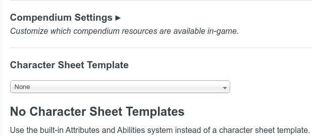
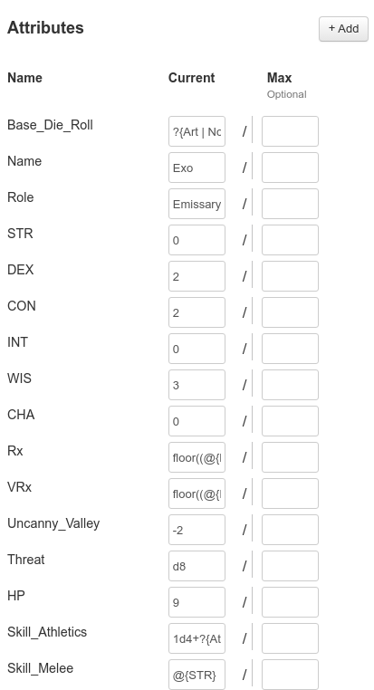
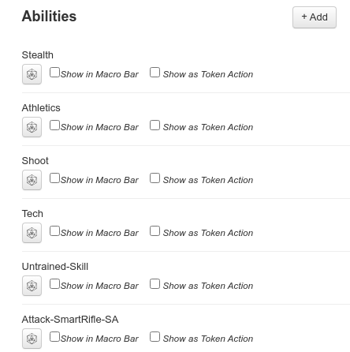
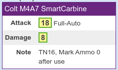
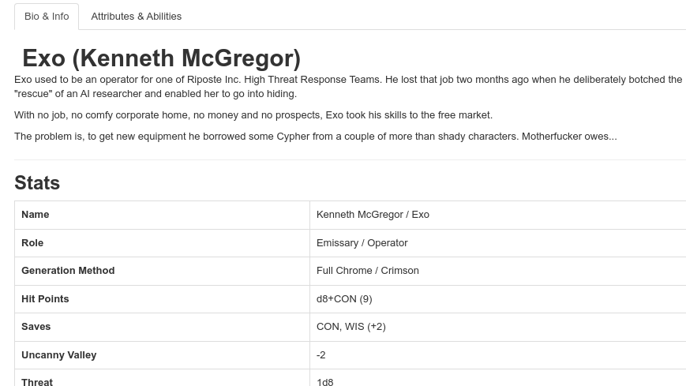
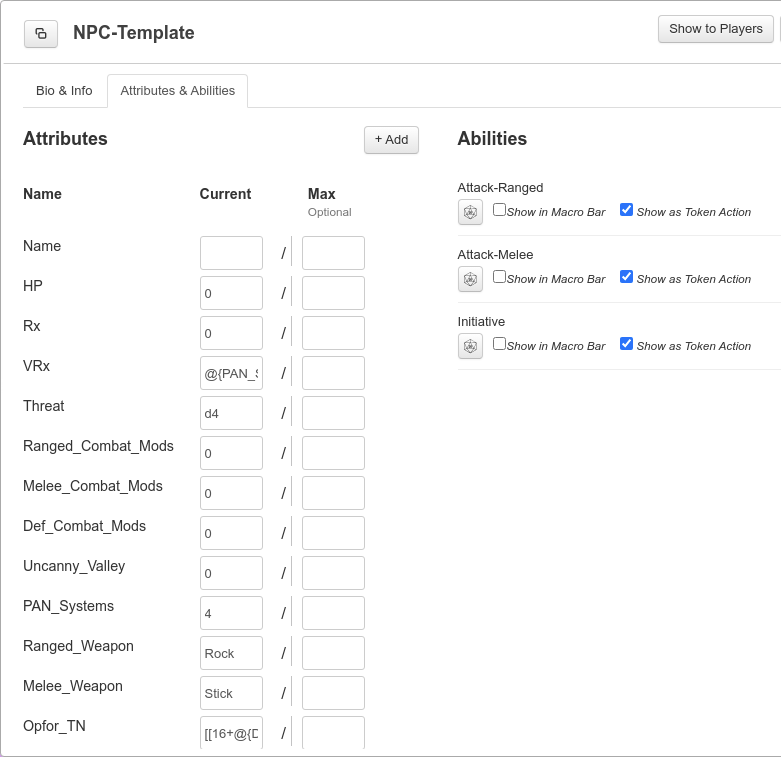
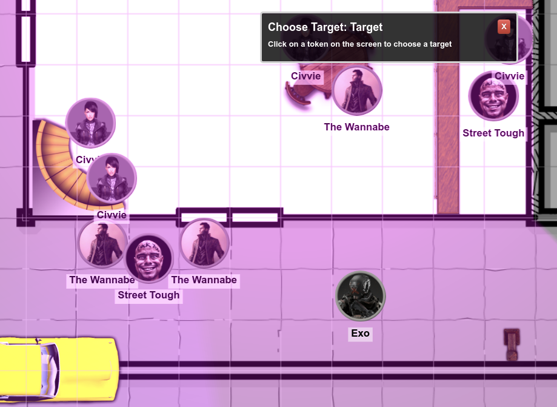

# HowTo: Setting up a Neon Blood character with rudimentary functionality in Roll20

## Table of contents
- [HowTo: Setting up a Neon Blood character with rudimentary functionality in Roll20](#howto-setting-up-a-neon-blood-character-with-rudimentary-functionality-in-roll20)
  - [Table of contents](#table-of-contents)
  - [What is this about?](#what-is-this-about)
  - [Game setup](#game-setup)
  - [Character creation](#character-creation)
    - [Considerations](#considerations)
    - [Creating the (template) character](#creating-the-template-character)
      - [Attributes and Abilities](#attributes-and-abilities)
        - [What do I use for attributes?](#what-do-i-use-for-attributes)
        - [Attribute list](#attribute-list)
        - [Using Abilities](#using-abilities)
          - [Untrained Skills and Saving Throws](#untrained-skills-and-saving-throws)
          - [Combat Rolls and Defense](#combat-rolls-and-defense)
      - [Putting it all together](#putting-it-all-together)
  - [Npc creation](#npc-creation)
    - [Setting up targeted rolls against varying target numbers (TN)](#setting-up-targeted-rolls-against-varying-target-numbers-tn)
      - [Automatically calculating damage and cleaning up defense output](#automatically-calculating-damage-and-cleaning-up-defense-output)
  - [Links](#links)

## What is this about?
There is currently no character sheet available for Neon Blood and I can't write Html for shit, so the only solution is to go back to basics and set up the character without an official sheet.

This is just a basic setup the sheet in my test sandbox, no Html or css files exist. I'm using Roll20 Pro, but everything in this doc works with a free subscription. But that also means no fancy API access (I ain't paying 100$ a year for something I'd almost never use), so we're gonna have to use some pretty weird workarounds to get something resembling conditions and the like.

## Game setup
To set up a game in Roll20 without a character sheet, simply create a new game and select 'none' in the character sheet drop down.<br>



This gives you a game where characters have only the 'Bio' and 'Attributes & Abilities' tabs.

## Character creation 
### Considerations
It is probably a good idea to create a template character for player characters (and one for npcs) that has all the required fields set to default values so that it can be duplicated when creating player characters (and npcs). Again there is no sheet, so there is no general template to create characters from. The default sheet is empty!

### Creating the (template) character
Say hello to Exo, former High Threat Response operator for Riposte Inc. He will be our template.<br>
<br>
We will spend most of our time here in the 'Attributes & Abilities' tab because most of the work lies here.

#### Attributes and Abilities
**Attributes** are (more or less) static values that can be accessed by macros using `@{attribute_name}`. They are also quite useful for wrapping common macro snippets (like the base die roll).<br>

**Abilities** are programmable actions (think character-specific macros) that are part of the character, i.e attacks, spells etc. They can use attributes (but not other abilities, found that one out the hard way) and can be accessed by external macros.

##### What do I use for attributes?
The basic and derived attributes are an obvious choice, also the character's *Name* and *Role*, *Threat* and *HP*. 
Then it gets interesting: I can use attributes to store parts of macros. They only work as part of a macro but they make the character sheet a lot more readable and introduce a degree of reusability into the sheet. I recommend setting up a basic die roll and *Trained Skill* values here.
The basic roll is nearly always the same and can be stored in an attribute as a [roll query](https://help.roll20.net/hc/en-us/articles/360037773133-Dice-Reference#DiceReference-RollQueries):

```javascript
// roll 1d20 (normal, ADV or DIS). a natural 13 is a critical something
?{Roll | Normal,1d20| ADV,2d20kh1| DIS,2d20kl1}cs13
```
The same goes for *Trained Skills*; we can use the skill value as part of a macro (Focus doesn't require its own attribute but may be useful):
```javascript
// Shoot skill value as an attribute
1d4+@{WIS}
```

##### Attribute list

This is a list of attributes I'm currently using in my sheet.

| Attribute name   | Default value // Explanation                                 |
| ---------------- | ------------------------------------------------------------ |
| Base_Die_Roll    | `?{Roll| Normal,1d20| ADV,2d20kh1| DIS,2d20kl1}cs13` // Basic die roll, used for abilities |
| Name             | The name of the character (not necessary, really)            |
| Role             | The role of the character (not necessary, really)            |
| STR              | 0 // Attribute modifier                                      |
| DEX              | 0                                                            |
| CON              | 0                                                            |
| INT              | 0                                                            |
| WIS              | 0                                                            |
| CHA              | 0                                                            |
| Rx               | `floor((@{DEX}+@{WIS})/2)` // Calculated value for Rx. Used in abilities |
| VRx              | `floor((@{INT}+@{WIS}+@{CHA})/3)` // Calculated value for VRx. Used in abilities |
| Uncanny_Valley   | 0 // Indicates the amount of cybertech                       |
| Threat           | d4 // Threat die                                             |
| HP               | 1 // Number of Hit Points                                    |
| Skill_Athletics  | `?{Attribute|Strength,@{STR}|Dexterity,@{DEX}}` // Athletic skill. Asks for STR or DEX, if Trained and/or Focused, enter Training die and Focus |
| Skill_Hack       | `@{INT}` // Hack skill. If Trained and/or Focused, enter Training die and Focus, i.e `1d4+@{INT}+1` |
| Skill_Melee      | `@{STR}` // Melee skill. If Trained and/or Focused, enter Training die and Focus, i.e `1d4+@{STR}+1` |
| Skill_Shoot      | `@{WIS}` // Shoot skill. If Trained and/or Focused, enter Training die and Focus, i.e `1d4+@{WIS}+1` |
| Skill_Stealth    | `@{DEX}` // Stealth skill. If Trained and/or Focused, enter Training die and Focus, i.e `1d4+@{DEX}+1` |
| Skill_Tech       | `@{INT}` // Tech skill. If Trained and/or Focused, enter Training die and Focus, i.e `1d4+@{INT}+1` |
| PAN_Systems      | 4 // PAN systems value. Used in abilities to calculate Threat |
| PAN_HP           | 1 // PAN HP                                                  |
| PAN_Threat       | `?{Mode | Open, 1d@{PAN_Systems}| Closed, 2}` // PAN Threat, calculated based on PAN mode |
| PAN_DefenseBonus | `@{PAN_Systems}/2` // Basic PAN Defense bonus. Used in VRx Defense ability |

 


##### Using Abilities

Ok, now that we have attributes, what can we do with them? Writing rollable abilities, of course.
In general, an ability roll for this sheet consists of the basic die roll (as above) plus modifiers, wrapped up into the default [RollTemplate](https://help.roll20.net/hc/en-us/articles/360037256794-Macros#Macros-UsingRollTemplates). The default Target Number is 16 (for validation against variable TNs, see [here](#setting-up-targeted-rolls-against-varying-target-numbers-tn)) and is always displayed as a note in the output.
*Trained Skills* also add a d4 (or higher). Abilities can be added to the sheet the same way as Attributes, so let's get to it.<br>

**Note:** Roll20 macros are basically run by a string interpreter, so placement of brackets and whitespaces is incredibly important (debugging macro errors is not fun and/or possible (apart from Trial-and-Error) and misplacing these characters can break an entire macro).<br><br>



###### Untrained Skills and Saving Throws
*Untrained Skill Checks* and *Saves* are basically the same, with some minor differences:

```javascript
// Untrained Skill Check, asks for an attribute and bonuses to roll
// Note the use of Uncanny Valley for CHA
&{template:default} {{name=Untrained Skill}} {{skill=[[@{Base_Die_Roll}+?{Attribut|Strength,@{STR}|Dexterity,@{DEX}|Constitution,@{CON}|Intelligence,@{INT}|Wisdom,@{WIS}|Charisma,@{CHA}+@{Uncanny_Valley}}+?{Bonus|0}]]}} {{note=TN16}}

// Saving Throw
// Note the Save bonuses for the Emissary Role and Uncanny Valley for CHA
&{template:default} {{name=Saving Throw}} {{save=[[@{Base_Die_Roll}+?{Attribut|Strength,@{STR}|Dexterity,@{DEX}|Constitution,@{CON}+2|Intelligence,@{INT}|Wisdom,@{WIS}+2|Charisma,@{CHA}+@{Uncanny_Valley}}+?{Bonus|0}]]}} {{note=TN16}}
```
###### Combat Rolls and Defense
Combat and Defense rolls are not that different from the above macros, but output and some combat options make them necessary:
```javascript
// Attack roll for an assault rifle in Single Action Mode.
// Exo has a SmartLink and the weapon is a SmartGun, so the roll has a fixed +1 bonus
&{template:default} {{name=Colt M4A7 SmartCarbine}} {{attack=[[@{Base_Die_Roll}+@{Skill_Shoot}+1+?{Bonus|0}]] Single Action}} {{damage=[[1@{Threat}]]}}{{note=TN16}}

// Attack roll for an assault rifle in Full-Auto Mode.
// Note the bonuses to hit and the difference in damage calculation.
&{template:default} {{name=Colt M4A7 SmartCarbine}} {{attack=[[@{Base_Die_Roll}+@{Skill_Shoot}+1-4+?{Bonus|0}]] Full-Auto}} {{damage=[[2@{Threat}k1]]}}{{note=TN16, Mark Ammo 0 after use}}

// VR attack roll against an A2i (Slay)
// Note: The App and Bonus values have to only be entered once, Roll20 treats them as variables for this macro.
// This may be a problem if something gives a bonus to attack but not a bonus to damage.
&{template:default} {{name=Slay (Hack)}} {{attack=[[@{Base_Die_Roll}+@{Skill_Hack}+?{Apps|0}+?{Bonus|0}]]}} {{damage=[[@{PAN_Threat}+?{Apps|0}+?{Bonus|0}]]}}{{note=TN16}}

// Regular Defense roll
// Exo has the Jaeger Advancement, so he gets a fixed +1 bonus to Defense
&{template:default} {{name=Defense}} {{defense=[[@{Base_Die_Roll}+@{Skill_Athletics}+@{Rx}+1+?{Bonus|0}]]}} {{note=TN16}}

// VRx Defense roll
// Note the added defense bonus based on Open/Closed mode
&{template:default} {{name=VRx Defense}} {{defense=[[@{Base_Die_Roll}+@{Skill_Tech}+@{VRx}+@{PAN_DefenseBonus}+?{PAN Mode | Open, 0| Closed, +1}+?{Bonus|0}]]}} {{note=TN16}}
```
The result looks something like this:<br>


#### Putting it all together
That's basically it. With minor variations, nearly all checks can be written as described above.

I also put the character information into the 'Bio' tab, that way it feels like a 'real' character sheet and is readable by humans.<br>



## Npc creation

Creating NPCs is easy-peasy compared to player characters as they have waaay less attributes and actually only two or three ranged, melee or social attacks.<br>


That's it, really

```javascript
// Example ranged attack with fire modes. Don't use them if a weapon doesn't have them ;)
&{template:default} {{name=@{Ranged_Weapon}}} {{damage=[[?{Mode| SA, 1@{Threat}+@{Ranged_Combat_Mods}| BF, 1@{Threat}+1d4+@{Ranged_Combat_Mods}| FA, 2@{Threat}k1}+@{Ranged_Combat_Mods}]]}}{{note=You get shot!}}

// Example Melee attack...'nuff said
&{template:default} {{name=@{Melee_Weapon}}} {{damage=[[1@{Threat}+@{Melee_Combat_Mods}]]}}{{note=You get stabbed!}}
```

### Setting up targeted rolls against varying target numbers (TN)
Some NPCs modify the target numbers to Defense or skill rolls. As the GM never rolls any attacks, it might be useful to query a NPC for any modifiers to the TN and use that as a target number in a defense roll.
The normal command for rolls against a target number is `/roll 1d20>16`. This tells us whether or not the roll was a success (roll >= 16). This approach doesn't work for combined rolls as the ones in Neon Blood (:sadface). If I were to roll `/roll {3d8+1}>3`, Roll20 would evaluate every single roll and not the sum of all rolled dice. To work around that, we have to generate a "group" with a fake die roll: `/roll {3d8+1, 0d0}>5`. This evaluates all individual rolls but counts the 3d8+1 as a single roll (silly, but it works, so fuck it).
Now that we have this problem solved, how do we get the modifiers to defense from the attacker? First, we have to add a new attribute `Opfor_TN` to our NPC character sheet and fill it with a modified TN value (The base TN is 16 and I already added another attribute `Def_Combat_Mods`, so I can just add these two together). I can now use the global `target` attribute to query attributes for a selectable target. Whenever I trigger the ability, Roll20 will ask for a target to be selected and get the Opfor_TN from there.

```javascript
// Attribute in the NPC sheet
// Name: Opfor_TN, Value: [[16+@{Def_Combat_Mods}]]

// Targeted defense in Exos character sheet
// Note the use of @target
&{template:default} {{name=Defense against TN @{target|Opfor_TN}}} {{defense=[[{@{Base_Die_Roll}+@{Skill_Athletics}+@{Rx}+1+?{Bonus|0}, 0d0}>@{target|Opfor_TN}]]}}
```  


The result looks something like this:<br>


#### Automatically calculating damage and cleaning up defense output


## Links

1. [Roll20 dice reference](https://help.roll20.net/hc/en-us/articles/360037773133-Dice-Reference)
2. [Roll20 macros](https://help.roll20.net/hc/en-us/articles/360037256794-Macros)