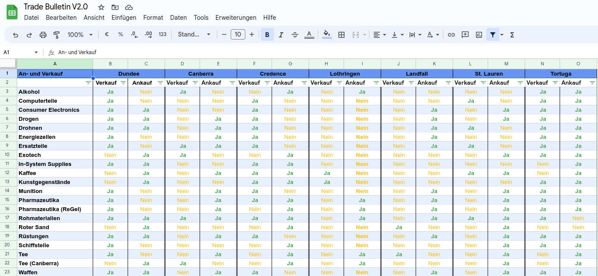
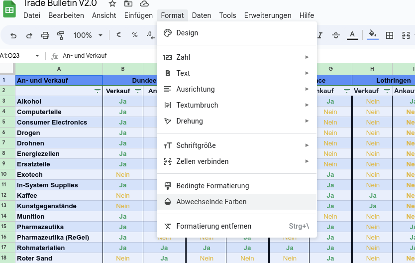
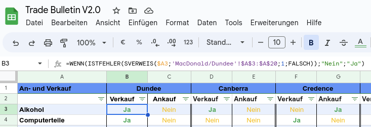
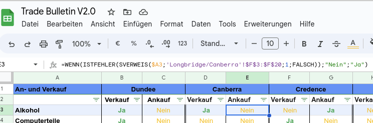
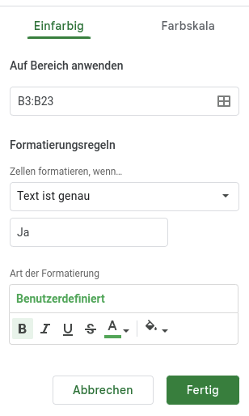
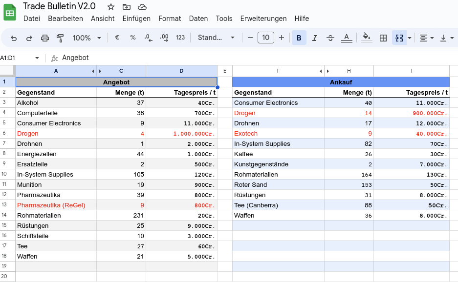
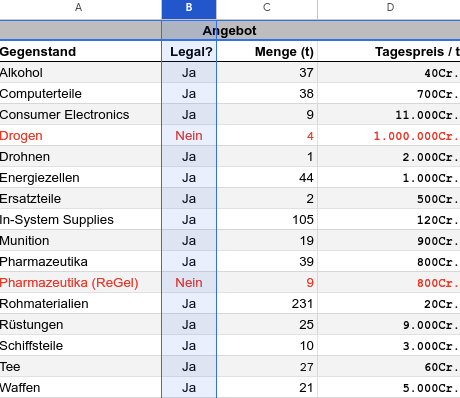
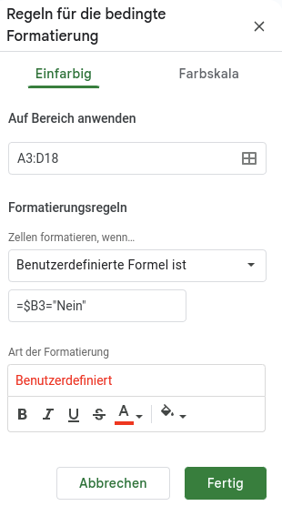

# HowTo - Aufsetzen eines automatisierten Trade Bulletins

## Ein was?
Der Trade Bulletin ist ein Handelsblatt, welches An- und Verkäufe mit Mengen, Preisen und Legalität an verschiedenen Orten beschreibt.<br>
In diesem HowTo wird gezeigt, wie man einen solchen Bulletin in Google Sheets für Stars Without Number, konkret den Uri Cantus Sektor, aufsetzen kann.<br> 
Die angewendeten Mechanismen lassen sich natürlich auf beliebige andere Systeme und Kampagnen abbilden.<br>

Konkret besteht der Bulletin aus einer Übersicht, die anzeigt, auf welchen Welten was gehandelt wird und aus Seiten für die einzelnen Welten mit Listen für An- und Verkäufe, inklusive vorhandener bzw. gefragter Mengen, Tagespreise und deren Legalität.<br>

Weiterhin soll der Bulletin so automatisiert werden, das folgende Dinge nicht von Hand angepasst werden müssen:
1. Die Übersicht zeigt für eine Welt automatisch, ob etwas gehandelt oder nicht gehandelt wird
   1. Wenn etwas gehandelt wird, soll es grün und fett angezeigt werden, sonst gelb
   2. An- und Verkauf sollen getrennt sein
2. Die Übersichtsseite soll einzelne Kategorien filterbar machen
3. Auf den Seiten für die Welten sollen:
   1. Die Mengen zufällig generiert werden
   2. Die Preise für An- und Verkauf entsprechend den Regeln für Handel nach Stars Without Number Revised Edition berechnet werden
   3. Waren, die auf der Welt als illegal gelten, sollen rot markiert werden

## Tabellenblätter

Zunächst einmal werden die folgenden Tabellenblätter angelegt:
* Eine Übersichtsseite (Optional, aber ich finde sie nützlich)
* Eine Seite für jedes System, in dem die Spieler Handel treiben können (es sollte also zum Beispiel erreichbar sein)

<div style="page-break-after: always;"></div>

### Übersichtsseite
Die Übersichtsseite stellt eine Tabelle zur Verfügung, in der alle Waren und alle Welten dargestellt werden.<br>


Die Einfärbung der Tabelle wird über die Option `Format:Abwechselnde Farben` erreicht.<br>


#### Automatisierung

##### Wird etwas gehandelt?
Wie finde ich jetzt heraus, ob etwas in einem System gehandelt wird? Das ist etwas tricky, da sich die entsprechenden Daten ja auf einem anderen Blatt befinden (werden :wink:
). Zum Glück gibt es die Funktion `SVERWEIS` (eng. `VLOOKUP`), die uns die Werte eines bestimmten Datenbereichs liefern kann, auch von anderen Blättern. DIe Funktion sucht in einem bestimmten *Bereich* nach einem bestimmten *Schlüsselwert* und liefert dann den *Wert* eines relativ dazu gelagerten *Index* zurück. Falls keine Zeile mit den Schlüsselwort gefunden wird, gibt die Funktion einen Fehler zurück.<br>
Der Aufruf für `SVERWEIS` sieht so aus: <br>

```swift
SVERWEIS($schluesselwert;$suchbereich;$index;$istSortiert)
```
Als Schlüsselwort verwenden wir den Zellwert der Ware, die wir abfragen wollen, zum Beispiel `$A3` für Alkohol.<br>
Wir möchten nur wissen, *ob* eine Ware gehandelt wird, daher können wir es uns recht einfach machen und eine Formel etwa in dieser Form schreiben:<br>
`WENN wir mit SVERWEIS nach einer bestimmten Ware suchen und KEINEN FEHLER bekommen, dann wird die Ware gehandelt`<br>

```swift
=WENN(ISTFEHLER(SVERWEIS($A3;'MacDonald/Dundee'!$A$3:$A$20;1;FALSCH));"Nein";"Ja")
```

* Der Suchbereich folgt der Syntax für den Zugriff auf Daten aus anderen Tabellen, also der volle Name der Tabellenseite, Ausrufezeichen und dann der zu durchsuchende Bereich. Für Verkauf ist der Bereich die Spalte mit den zu verkaufenden Waren und für Ankauf die Spalte mit den anzukaufenden Waren. In unseren Tabellen also die Spalten A und F (siehe weiter unten).
* Als Index nehmen wir einfach die Zelle, in der der Warenname steht (Index ist relativ zur durchsuchenden Spalte und startet mit 1, der Wert zielt also auf den Warennamen)
* Der letzte Parameter gibt an, ob die zu durchsuchenden Daten sortiert sind. FALSCH sagt der Funktion, dass sie annehmen soll, die Daten wären nicht sortiert, auch wenn sie es sind.

Diese Funktion wird für *jede Zelle in An- und Verkauf* für jede Welt eingetragen.<br>
<br>
<br>

##### Datenfilterung
Um die Daten in der Übersicht filterbar zu machen, stellt Google Sheets (und Excel) konfigurierbare [Filterfunktionen](https://support.google.com/docs/answer/3540681) zur Verfügung, die wir einfach verwenden können.

<div style="page-break-after: always;"></div>

##### Bedingte Formatierung für Textfarben
Wir möchten die Daten jetzt noch farbig darstellen, dafür verwenden wir die [Bedingte Formatierung](https://support.google.com/docs/answer/78413). Diese ändert zum Beispiel die Textfarbe, wenn eine Zelle einen bestimmten Wert enthält.<br>
<br>
<br>

<div style="page-break-after: always;"></div>

### Welten
Jede erreichbare Welt, die interstellaren Handel betreibt, erhält ihr eigenes Tabellenblatt, hier zum Beispiel die Welt Dundee im MacDonald System:<br>
<br>

Jede Welt hat Dinge, die sie an- und verkauft. Einige davon sind illegal.
Dundee ist eine indisch-caledonische High-Tech Welt mit einer großen Schiffswerft und sehr libertären Wurzeln, daher handeln sie mit so ziemlich allem, was irgendwie Geld bringt.<br> 
Auf der Welt gibt es eine besondere biologische Substanz namens ReGel, die die Wirksamkeit von Medikamenten und Kosmetika drastisch erhöht. Vor kurzem gab es allerdings einen Zwischefall, daher ist der Export aktuell illegal.

#### Automatisierung
Die Mengen und Preise sollen zufallsgeneriert sein.
Google Tabellen liefert zum Glück die Funktion `ZUFALLSBEREICH` (eng. `RANDBETWEEN`), die eine zufällige Zahl zwischen einem Minimal- und einem Maximalwert generiert.

##### Mengenberechnung
Einfach. Die verfügbare Menge (in Tonnen) für zum Beispiel Alkohol ist ein Wert zwischen 1 und 50.<br>

```swift
=ZUFALLSBEREICH(1;50)
```
Die Fomel wiederholen wir für jede Zeile, die Mengen kann man nach Belieben verändern.

##### Preisberechnung
Preise lassen sich ähnlich wie Mengen erzeugen, allerdings gelten hier die Spielregeln:
1. Einkauf ist `2W6` (ein Wert zwischen 2 und 12) multipliziert mit einem Warenwert
   1. 10 für billige Rohgüter, zum Beispiel Tee
   2. 100 für einfache technologische Güter, wie zum Beispiel Munition oder Ersatzteile
   3. 1000 für komplexe High-Tech Waren, wie zum Beispiel Waffen oder Schiffskomponenten
   4. (10.000 für Exotech. Selten und extrem wertvoll)
   5. (100.000 Drogen. Das simuliert die brutalen Gewinnmargen illegaler Drogen, wenn man da billig rankommt. Das ist möglich, die Welt Credence z.B. hat Drogen legalisiert und dort ist der Einkauf extrem günstig, auch wenn die Ausfuhr illegal ist)
2. Verkauf sind standardmäßig `2W6+1` (oder einanderer Modifikator, je nach Nachfrage, Seltenheit, Spielleiterwillkür, etc.), multipliziert mit den gleichen Gewichtungen wie beim Einkauf

Beispiel für den Kauf Waffen:<br>
```swift
=ZUFALLSBEREICH(2;12)*1000
```
Beispiel für den Verkauf von Waffen:<br>
```swift
=(ZUFALLSBEREICH(2;12)+1)*1000
```

Damit das Ganze in Credits angezeigt wird, kann man die Zelle als Benutzerdefinierte Währung formatieren.
Der Wert aktualisiert sich automatisch jede Stunde, oder jedes Mal, wenn die Tabelle verändert wird. Dies lässt sich über die Einstellungen der Tabelle manipulieren.

##### Bedingte Formatierung für Textfarben
Illegale Waren sollen rot markiert werden, also fügen wir eine neue Spalte in beiden Tabellen hinzu und tragen dort ein, ob etwas legal ist oder nicht:<br>
<br>
Nun nutzen wir wieder die bedingte Formatierung<br>
<br>
und blenden die Spalte aus (Die Spieler brauchen sie nicht sehen und die Formatierung funktioniert auch, wenn die Spalte unsichtbar ist).
Ob man jetzt für jegale Waren "Ja" und illegale "Nein" oder "X" und nichts, oder sonstwas einträgt, ist eigentlich egal, solange sich legal und illegal eindeutig unterscheiden lassen. 
