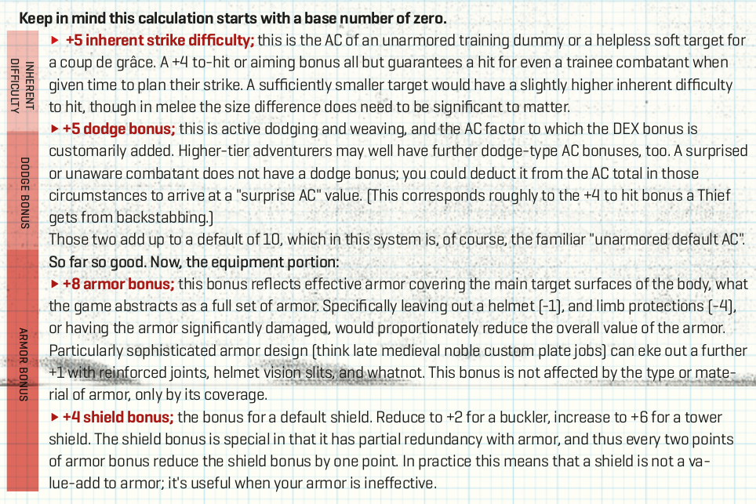

# Alternative Rüstungsregeln nach Knock!#4

## Einleitung

In dem Artikel "Novel AC math or armor penetration made easy" von Eero Tuovinen in [Knock! Ausgabe 4](https://www.themerrymushmen.com/product/knock-4-tmm/) wird ein Modell für die Berechnung von Rüstungsklassen vorgestellt, das ich ganz interessant finde.

Nicht nur, dass es einen Ausweg aus dem "wenn ich eine schwerere Rüstung habe, bin ich schwieriger zu verletzen, egal mit was" Problem liefert, es scheint auch noch verhältnismäßig einfach und am Tisch verwendbar zu sein. So man also Lust auf "etwas" mehr Realismus bei seinen D&D Rüstungen haben will,dann könnte das System hier ganz interessant sein.

## Die Grundlagen in Stichpunkten

Die Rüstungsklasse (AC, Armor Class) in D&D und verwandten Systemen ist ein abstrakter Wert für die Schnelligkeit und Widerstandsfähigkeit eines Charakters, sprich, wie schwierig er oder sie zu verwunden ist.  

- Aktuell kann man sich eine bessere "Rüstungszahl" einfach mit Geld kaufen.
- Ein Schwert sollte gegen eine Schwere Rüstung nicht genauso effektiv sein wie ein Bec-de-Corbin
- Schilde sollten besser sein
- Leichte Rüstungen sollten effektiv gegen leichte Waffen sein.

Das neue System ändert ein paar dieser Grundlagen:

- Der *Wert* der Rüstungsklasse wird nicht mehr durch ihren *Typ* bestimmt. Die Rüstungsklasse sagt jetzt eher aus, ob die Rüstung gegen einen bestimmten Angriff *effektiv* ist.
- Schilde sind jetzt nützlich, wenn die Rüstung nicht effektiv ist.

## Das neue System

